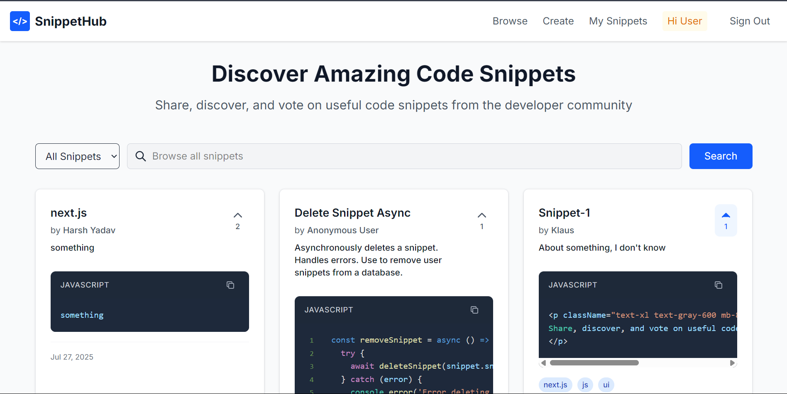
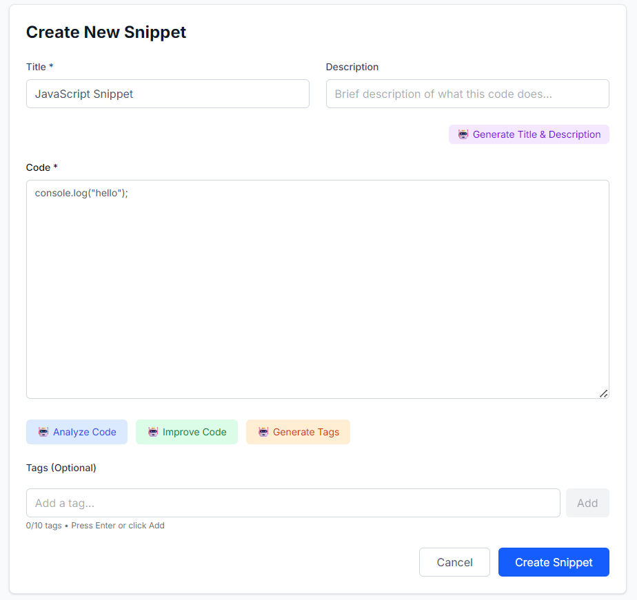
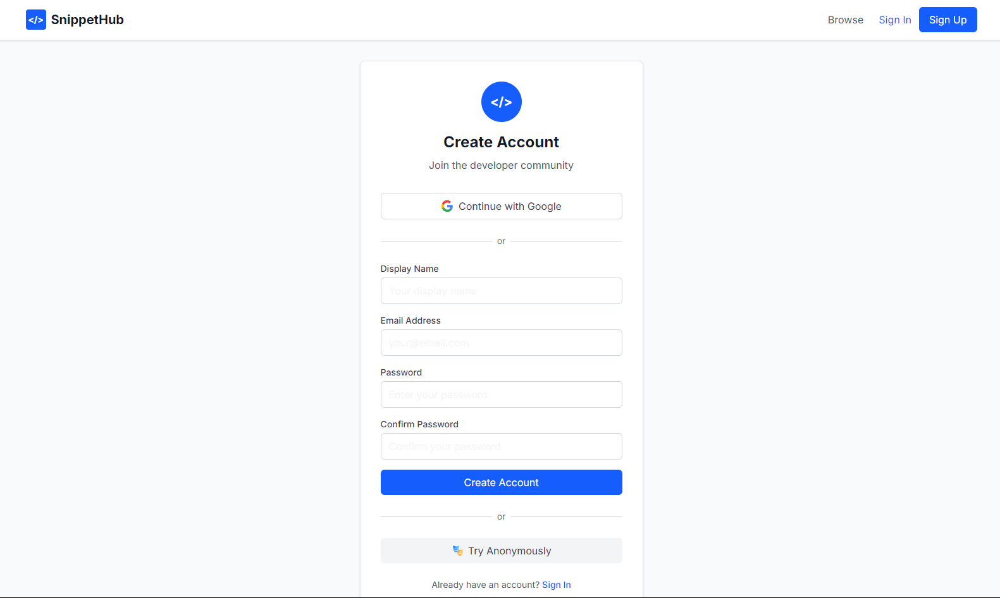

🏆 This is my first hackathon project! Built with a completely new tech stack in record time as part of boot.dev 3-day hackathon. If you're impressed by what I've built, please give this repo a ⭐ - voting closes today at 11:30 PM! Every star helps! 🙏

# 🚀 AI-Powered Code Snippet Manager

A modern, full-stack web application for developers to share, discover, and manage code snippets with AI-powered features.



## ✨ Features

### Core Features

- **Create & Share Snippets**: Create code snippets with title, description, and tags
- **Browse & Search**: Discover snippets by text search or tags
- **Voting System**: Upvote useful snippets to help others find the best content
- **User Management**: Full authentication with multiple sign-in options

### AI-Powered Features (Using Gemini API)



- **Smart Tags**: Automatically generate relevant tags for your code
- **Code Analysis**: Get insights on potential bugs, performance issues, and best practices
- **Code Improvement**: AI suggestions to make your code better
- **Auto Title/Description**: Generate meaningful titles and descriptions from code
- **Language Detection**: Automatically detect programming languages

### Authentication Options



- **Email/Password**: Traditional account creation
- **Google OAuth**: Quick sign-in with Google account
- **Anonymous Access**: Try the app without signing up
- **Session Persistence**: Your work is saved across sessions

### Enhanced Code Display

- **Syntax Highlighting**: Beautiful code display with VS Code Dark+ theme
- **Code Formatting**: Automatic code formatting using Prettier
- **Language Detection**: Smart language detection for proper highlighting
- **Copy to Clipboard**: One-click code copying
- **Expandable View**: Show/hide full code for long snippets

## 🛠️ Tech Stack

- **Frontend**: Next.js 14, React, Tailwind CSS
- **Backend**: Supabase (PostgreSQL + Real-time + Functions)
- **Authentication**: Firebase Auth (Email, Google, Anonymous)
- **AI**: Google Gemini API (Free tier)
- **Code Display**: React Syntax Highlighter with Prettier formatting
- **Deployment**: Vercel-ready

## 📁 Project Structure

```md
├── src/
│ ├── app/
│ │ ├── auth/ # Authentication pages
│ │ ├── create/ # Create snippet page
│ │ ├── edit/[id]/ # Edit snippet page
│ │ ├── my-snippets/ # User's snippets dashboard
│ │ ├── globals.css # Global styles
│ │ ├── layout.js # Root layout
│ │ └── page.js # Home page
│ ├── components/
│ │ ├── Navbar.js # Navigation component
│ │ ├── SnippetCard.js # Individual snippet display
│ │ ├── SearchBar.js # Search functionality
│ │ └── LoadingSpinner.js # Loading states
│ ├── contexts/
│ │ └── AuthContext.js # Authentication context
│ └── lib/
│ ├── auth.js # Database functions
│ ├── firebase.js # Firebase configuration
│ └── gemini.js # AI integration
├── database/
│ ├── schema.sql # Database schema
└── README.md
```

## 🚀 Quick Start

### Prerequisites

- Node.js 18+ and npm
- Supabase account
- Firebase account (for authentication)
- Google AI Studio account (for Gemini API)

### 1. Clone & Install

```bash
git clone <your-repo>
cd code-snippet-manager
npm install
```

### 2. Database Setup

1. Create a new Supabase project
2. Run the SQL schema from `snippethub_schema.sql` in your Supabase SQL editor
3. Note your Supabase URL and anon key

### 3. Firebase Setup

1. Create a new Firebase project
2. Enable Authentication with Email/Password and Google providers
3. Enable Anonymous authentication
4. Get your Firebase configuration

### 4. Environment Variables

Create `.env.local`:

```env
# Supabase
NEXT_PUBLIC_SUPABASE_URL=your_supabase_url
NEXT_PUBLIC_SUPABASE_ANON_KEY=your_supabase_anon_key

# Firebase
NEXT_PUBLIC_FIREBASE_API_KEY=your_firebase_api_key
NEXT_PUBLIC_FIREBASE_AUTH_DOMAIN=your_firebase_auth_domain
NEXT_PUBLIC_FIREBASE_PROJECT_ID=your_firebase_project_id
NEXT_PUBLIC_FIREBASE_STORAGE_BUCKET=your_firebase_storage_bucket
NEXT_PUBLIC_FIREBASE_MESSAGING_SENDER_ID=your_firebase_messaging_sender_id
NEXT_PUBLIC_FIREBASE_APP_ID=your_firebase_app_id

# Gemini AI
NEXT_PUBLIC_GEMINI_API_KEY=your_gemini_api_key
```

### 5. Run Development Server

```bash
npm run dev
```

Visit `http://localhost:3000` and start coding! 🎉

## 🔧 Configuration

### Supabase Setup

1. **Database**: Uses PostgreSQL with custom functions and views
2. **Real-time**: Optional for live updates
3. **Row Level Security**: Disabled (handled by Firebase Auth)

### Firebase Authentication Setup

1. **Email/Password**: Enable in Firebase Console
2. **Google Provider**: Configure OAuth consent screen
3. **Anonymous**: Enable anonymous authentication
4. **Domain Configuration**: Add your domain to authorized domains

### Gemini API Setup

1. Get a free API key from [Google AI Studio](https://makersuite.google.com/)
2. Free tier includes 15 requests per minute
3. All AI features have rate limiting built-in

## 📊 Database Schema

### Core Tables

- **users**: User profiles linked to Firebase UIDs
- **snippets**: Code snippets with content and tags
- **snippet_votes**: Voting system for snippets

### Advanced Features

- **Views**: Pre-computed snippet details with vote counts
- **Functions**: Complex queries for user vote status and popular tags
- **Indexes**: Optimized for search and performance
- **Triggers**: Automatic timestamp updates

## 🎯 Key Components

### Authentication System

- **Firebase**: Handles all authentication (email, Google, anonymous)
- **Supabase**: Stores user profiles using Firebase UIDs as primary keys
- **Seamless Integration**: Automatic profile creation on first sign-in

### Enhanced Code Display (`components/SnippetCard.js`)

- **Prettier Integration**: Automatic code formatting
- **Multi-language Support**: JavaScript, TypeScript, Python, HTML, CSS, and more
- **Smart Language Detection**: Based on code patterns and tags
- **Syntax Highlighting**: VS Code Dark+ theme with line numbers
- **Interactive Features**: Copy, expand/collapse, owner actions

### AI Integration (`lib/gemini.js`)

- **Smart Tag Generation**: Context-aware tag suggestions
- **Code Analysis**: Bug detection and performance insights
- **Code Improvement**: AI-powered code enhancement
- **Language Detection**: Automatic programming language identification
- **Rate Limiting**: Built-in protection for free tier usage

### Advanced Search (`components/SearchBar.js`)

- **Multi-mode Search**: All snippets, text search, or tag filtering
- **Real-time Results**: Instant search feedback
- **Smart Suggestions**: Tag-based filtering with hints

## 🚀 Deployment

### Vercel (Recommended)

1. Connect your GitHub repository
2. Add all environment variables
3. Deploy automatically with zero configuration

### Environment Variables for Production

Ensure all environment variables are set in your deployment platform:

- Supabase credentials
- Firebase configuration
- Gemini API key

## 🔒 Security Features

### Authentication Security

- **Firebase Auth**: Industry-standard authentication
- **Multi-provider Support**: Email, Google, and anonymous options
- **Secure Token Handling**: Automatic token refresh

### Database Security

- **Firebase UID Integration**: Secure user identification
- **Input Validation**: Comprehensive data sanitization
- **No RLS Dependency**: Security handled at application layer

### API Security

- **Rate Limiting**: AI API calls are rate-limited
- **Error Handling**: Graceful degradation when services are unavailable
- **Environment Variables**: Sensitive keys stored securely

## 🎨 UI/UX Features

### Modern Design

- **Responsive Layout**: Works on all device sizes
- **Tailwind CSS**: Utility-first styling
- **VS Code Theme**: Familiar code highlighting
- **Smooth Animations**: Hover effects and transitions

### User Experience

- **Loading States**: Clear feedback for all operations
- **Error Handling**: User-friendly error messages
- **Accessibility**: Proper contrast and semantic markup
- **Mobile Optimized**: Touch-friendly interface

## 📝 Usage Examples

### Creating a Snippet

1. Sign in with email, Google, or try anonymously
2. Click "Create" in the navbar
3. Paste your code and use AI features:
   - Generate smart tags
   - Analyze code quality
   - Get improvement suggestions
   - Auto-generate title/description
4. Publish and share with the community

### Finding Snippets

1. Use the search bar with three modes:
   - **All Snippets**: Browse everything
   - **Search Text**: Find by title/description
   - **By Tag**: Filter by specific tags
2. Vote on useful snippets
3. Copy code with one click

### Managing Your Snippets

1. Visit "My Snippets" dashboard
2. Edit or delete your snippets
3. View your voting history
4. Track your most popular snippets

## 🔄 Recent Updates

### Authentication Improvements

- **Firebase Integration**: Replaced Supabase Auth with Firebase
- **Google OAuth**: Added Google sign-in support
- **Anonymous Access**: Enhanced anonymous user experience

### Code Display Enhancements

- **Prettier Formatting**: Automatic code beautification
- **Enhanced Syntax Highlighting**: VS Code Dark+ theme
- **Smart Language Detection**: Improved accuracy
- **Interactive Features**: Copy, expand/collapse functionality

### AI Feature Enhancements

- **Rate Limiting**: Better handling of API limits
- **Error Recovery**: Graceful fallbacks when AI is unavailable
- **Improved Prompts**: More accurate AI responses

## 🤝 Contributing

Constantly trying to improve the app. Areas for improvement:

- Additional language support for code formatting
- Enhanced AI prompts and analysis
- UI/UX improvements
- Performance optimizations
- Additional authentication providers

## 🐛 Known Issues & Limitations

- **Prettier Support**: Limited to JavaScript, TypeScript, HTML, CSS, JSON, and Markdown
- **AI Rate Limits**: Free tier has 15 requests per minute
- **Anonymous Sessions**: Data persists only during browser session

## 📄 License

This project is open source and available under the [MIT License](LICENSE).

## 🙏 Acknowledgments

- [Supabase](https://supabase.com/) for the powerful database platform
- [Firebase](https://firebase.google.com/) for reliable authentication
- [Google Gemini](https://ai.google.dev/) for AI capabilities
- [Next.js](https://nextjs.org/) for the fantastic React framework
- [Tailwind CSS](https://tailwindcss.com/) for beautiful styling
- [React Syntax Highlighter](https://github.com/react-syntax-highlighter/react-syntax-highlighter) for code display
- [Prettier](https://prettier.io/) for code formatting

---

**Happy Coding!** 🎉

If you found this helpful, please give it a ⭐ and share it with other developers!

## 📞 Support

If you encounter any issues:

1. Review the environment variables setup
2. Ensure all services (Supabase, Firebase, Gemini) are properly configured
3. Check the browser console for detailed error messages
